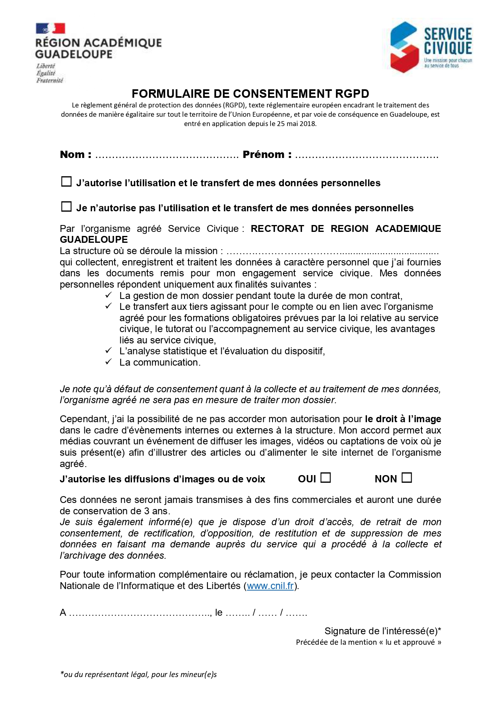

Title: Stage SIO1

> **<u>FICHE DESCRIPTIVE :</u>**

> <u>**Dates du stage :**</u>
>
> - **Date début :** 19/05/2025
> - **Date fin :** 27/06/2025
>
> **Entreprise :** Conseil départemental de Seine-et-Marne

# Présentation de l'entreprise/société : 
Le service système d'information et numérique dans lequel j'ai effectué mon stage créer des outils en interne pour aider les employés d'autre service, par exemple pour aider à la gestion des cantines en collège ou des outils plus spécifiques au besoin des autres employé

# Missions & tâches réalisés : 

**1 Principaux problèmes rencontrés**  
**1.1 Méthodologie dans la base de données**  
Premier problème concernant les bases de données au niveau méthodologique, j’ai rentré le contenu HTML directement dans la base de données et je le générais comme ça dans mon fichier.
Cette méthode n’était donc pas évolutive.
	Solution : J’ai utilisé une alternative qui n’étais toujours pas la bonne, j’ai mis mon code HTML dans mon fichier dans des « div » et je les affichais grâce au numéro des questions rentré dans ma base de données. Ensuite j’ai généré mes questions depuis ma base de données sans code brut ce qui se rapprochait de la bonne méthode.
 **1.2 Création et automatisation de la base de données**  
J’ai eu une mauvaise gestion des bases de données et particulièrement des IDs mais je m’en suis rendu compte seulement à la fin du projet en voulant faire des jointures car des IDs rentraient en conflits, donc les réponses ne correspondaient pas aux questions auxquelles elles devaient répondre. De plus j’adaptais ma base de données en fonction de mes besoins au fur et à mesure ce qui a également participer aux difficultés.
Exemple avec la gestion des sous questions sous forme de tableau où j’ai créé une table me permettant de gérer ce cas spécifique au moment où j’ai été confronté à ce problème et non avant.
Solution : Faire un plan clair avant de commencer quoi que ce soit, qui prend en compte les problèmes que je vais pouvoir rencontrer et qu’il me permet également d’être évolutif sans toucher au code. 
 **1.3 Insertion et sauvegarde des données au chargement**  
JavaScript/jQuery pour sauvegarder les données inséré et les ré insérer après un changement de pages ou un re chargement, les difficultés rencontrées était la gestion de chaque type de « input » et la ré insertion au chargement de la page ainsi que l’affichage des zones conditionnelles si la case était cochée. J’ai essayé d’utiliser le « sessionStorage() » de JavaScript mais je me suis vite retrouvé bloqué.
	Solution : Je n’ai pas trouvé de solution, j’ai donc utilisé l’IA pour le faire à ma place
 **1.4 Insertion des données en BDD**  
Sauvegarder les données pour les envoyer en même temps dans la base de données, j’ai testé différentes solutions avec chacune des problèmes spécifiques. AJAX était trop compliqué pour moi après avoir essayé de comprendre je suis passée à une autre solution. 
J’ai également utilisé la commande « UPDATE » à chaque changement de page mais vu que les données n’étant pas sauvegardé les données des pages précédentes et suivantes étaient vides j’entrais donc seulement les données de la page actuelle et entrais des données « null » pour le reste.
	Solution : Utilisation de la variable « $_SESSION » en php que je remplissais à chaque changement de page grâce à la méthode « POST » en redirigeant l’utilisateur grâce à un fichier « redirection.php ».

**2 Compétences apprises** 
**2.1 Méthodologie base de données** 
Après avoir réalisé mon projet et m’être rendu compte que ma structure ne fonctionnait pas mon tuteur ma expliqué comment penser et créer une base de donnée pour qu’elle soit évolutive à l’aide d’ID unique dans chaque table qui permet de modifier uniquement le libellé de la cible et d’utiliser également des clés étrangères avec par exemple les ID dans une table réponse pour lier une réponse à une question, ce qui offre la possibilité de créer un code qui évolue seulement en apportant des modifications à la base de données.
  **2.2 Découverte JavaScript/jQuery**  
J’ai découvert JavaScript lors du premier projet sur le formulaire RGPD pour rendre interactif les boutons qui était présent sur le formulaire, cela ma servit d’introduction sur JavaScript pour me montrer l’utilité et comment le langage se construit.
jQuery je l’ai utilisé à la fin de mon projet pour afficher les affichages conditionnels que je générais depuis la base de données, après avoir utilisé JavaScript quand j’utilisais le code en brut cela ma permit de me rendre compte le gain de temps et la facilité que cela apportait.
 **2.3 PHP et base de données** 
La suite du projet concernant PHP et les bases de données ma permit d’être plus à l’aise et d’approfondir le peu de connaissance dont je disposais en php, notamment avec la gestion des bases de données et comment aller chercher/insérer des données dedans.

**3 Autres** 
**3.1 Outil de travail** 
J’ai pu découvrir et utiliser les outils de travails présents dans le service, notamment les machines virtuelles avec WALLIX, les outils de communications avec ZOOM ou encore les outils de collaboration pour partager son travail avec GitLab.
De plus cela m’a introduit à l’installation et l’utilisation de XAMPP pour me permettre d’utiliser PHP et MySQL.

